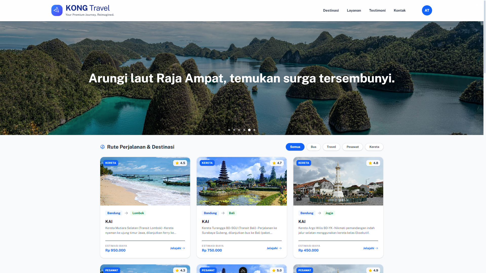
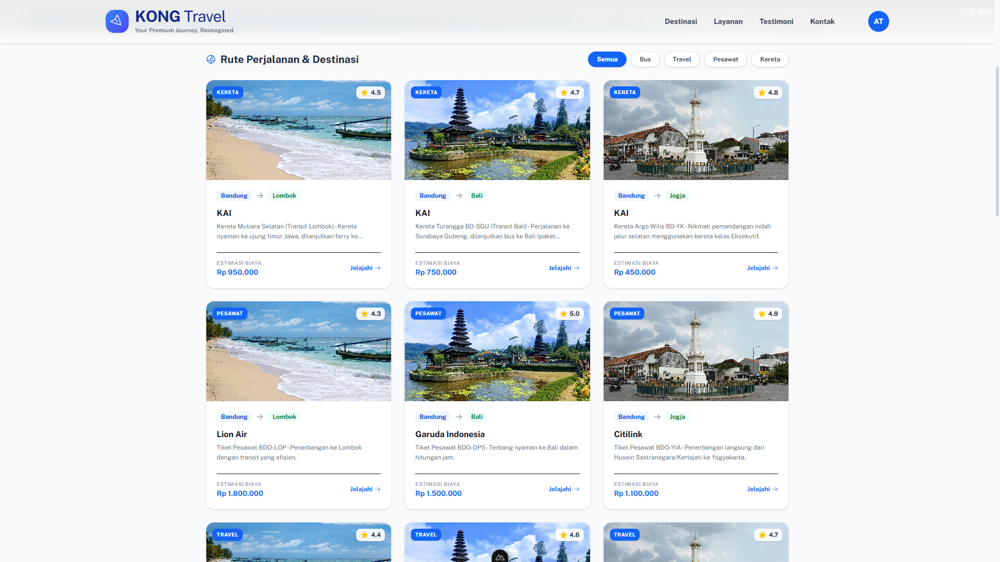
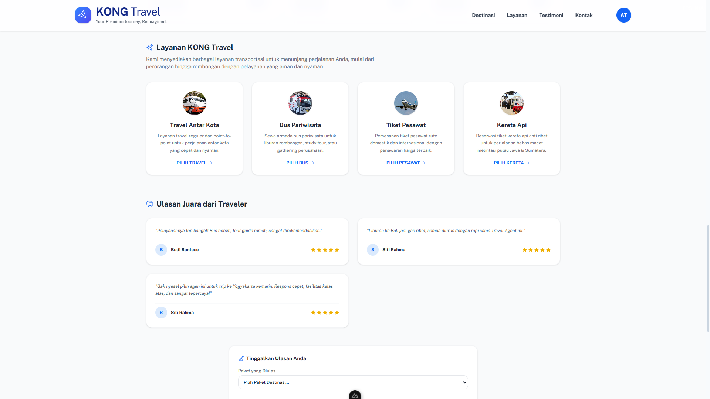
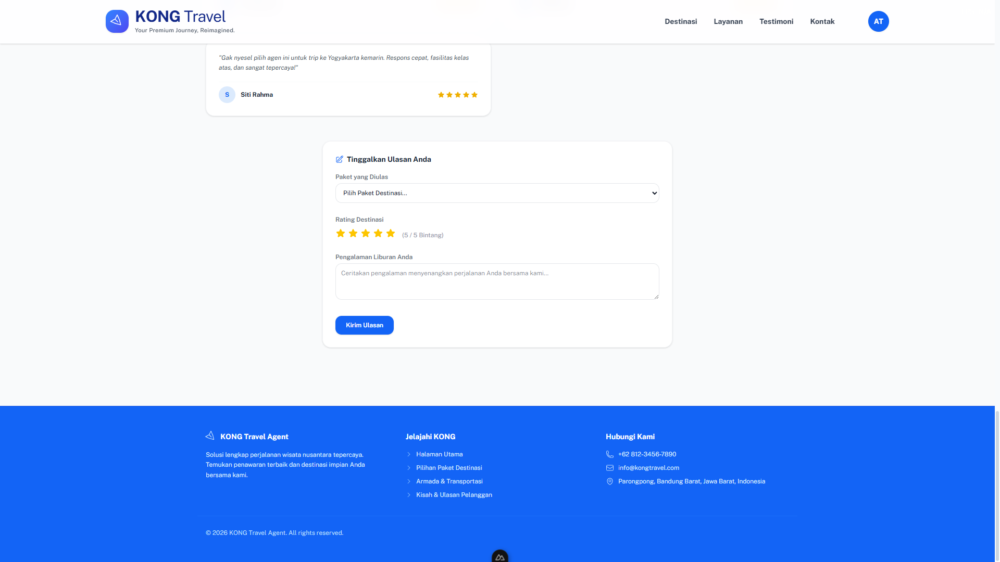
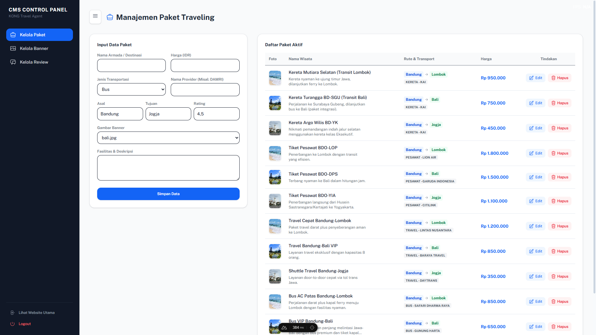
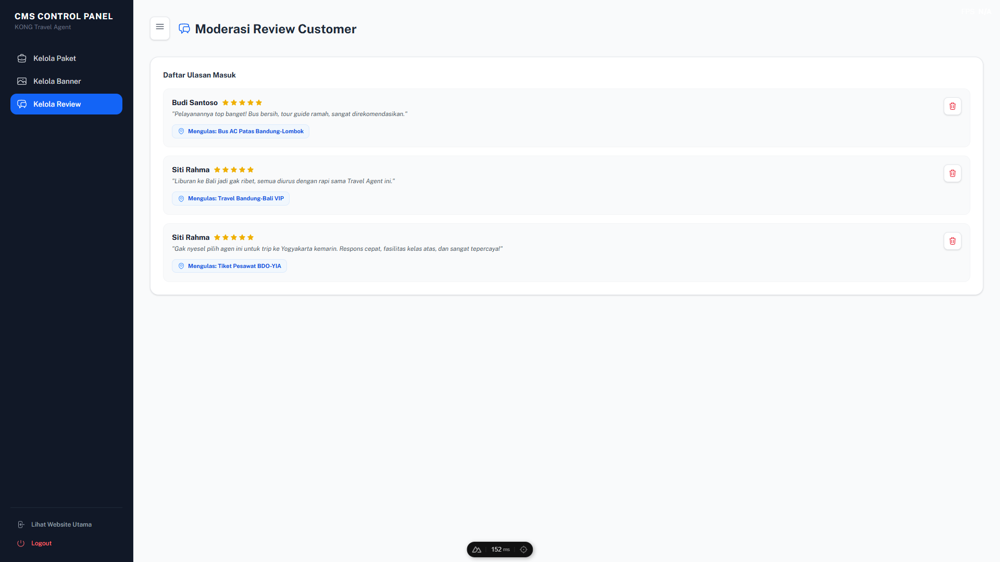

<div align="center">

# 🌴 KONG Travel Agent

**A full-stack travel agent web application for PT KONG Internship Assignment**

[](https://nuxt.com/)
[](https://adonisjs.com/)
[](https://www.mysql.com/)
[](https://www.typescriptlang.org/)

</div>

---

## 📸 Preview

> **Halaman Utama (Landing Page)**



> **Halaman Paket Wisata**



> **Halaman Paket Layanan**



> **Halaman Paket Review**



> **Admin Dashboard – Kelola Paket**



> **Admin Dashboard – Kelola Banner**



> **Admin Dashboard – Kelola Ulasan**


---

## ✨ Fitur Utama

### 👤 Halaman Publik (Customer)
- 🏠 **Landing Page** — Hero section, banner promosi, dan daftar paket wisata
- 🔍 **Filter Paket** — Filter berdasarkan jenis transportasi (Bus, Travel, Pesawat, Kereta)
- ⭐ **Ulasan Pelanggan** — Lihat dan kirim ulasan/testimoni perjalanan
- 🔐 **Autentikasi** — Login & Logout dengan sistem token

### 🛠️ Admin Dashboard (CMS)
- 📦 **Manajemen Paket** — Full CRUD (tambah, edit, hapus) data paket wisata
- 🖼️ **Manajemen Banner** — Full CRUD data banner promosi
- 💬 **Manajemen Ulasan** — Lihat dan hapus ulasan pelanggan
- 🔒 **Proteksi Halaman** — Semua halaman admin dilindungi middleware autentikasi

---

## 🏗️ Tech Stack

| Layer | Teknologi |
|-------|-----------|
| **Frontend** | Nuxt 4, Vue 3, Nuxt UI, Tailwind CSS 4 |
| **Backend** | AdonisJS 7, Lucid ORM, Tuyau |
| **Database** | MySQL 8 |
| **Auth** | AdonisJS Auth (Access Tokens) |
| **Language** | TypeScript |
| **Package Manager** | pnpm (Frontend), npm (Backend) |

---

## 📁 Struktur Proyek

```
Travel-Agent-Fullstack-Project/
│
├── 📂 FrontEnd/              # Nuxt 4 App
│   ├── app/
│   │   ├── pages/
│   │   │   ├── index.vue         # Halaman utama publik
│   │   │   ├── login.vue         # Halaman login
│   │   │   └── admin/
│   │   │       ├── packages.vue  # Admin – kelola paket
│   │   │       ├── banners.vue   # Admin – kelola banner
│   │   │       └── reviews.vue   # Admin – kelola ulasan
│   │   ├── components/
│   │   └── middleware/
│   └── public/               # Aset gambar statis
│
└── 📂 BackEnd/               # AdonisJS 7 API
    ├── app/
    │   ├── controllers/      # Request handlers
    │   └── models/           # Lucid ORM models
    ├── database/
    │   ├── migrations/       # Skema tabel database
    │   └── seeders/          # Data awal (seed)
    └── start/
        └── routes.ts         # Definisi semua API route
```

---

## 🚀 Cara Menjalankan Proyek

### Prasyarat
- Node.js `>= 20`
- MySQL `>= 8`
- pnpm (`npm install -g pnpm`)

---

### 1. Clone Repository

```bash
git clone https://github.com/ibung/Travel-Agent-Fullstack-Project.git
cd Travel-Agent-Fullstack-Project
```

---

### 2. Setup Backend

```bash
cd BackEnd

# Install dependencies
npm install

# Salin file environment
cp .env.example .env
```

Edit file `.env` dan sesuaikan konfigurasi database:
```env
DB_HOST=127.0.0.1
DB_PORT=3306
DB_USER=root
DB_DATABASE=kong_travel
```

```bash
# Jalankan migrasi database
node ace migration:run

# (Opsional) Jalankan seeder untuk data awal
node ace db:seed

# Jalankan server backend
npm run dev
# Backend berjalan di http://localhost:3333
```

---

### 3. Setup Frontend

```bash
cd ../FrontEnd

# Install dependencies
pnpm install

# Jalankan dev server
npx pnpm run dev
# Frontend berjalan di http://localhost:3000
```

---

## 🔌 API Endpoints

### Public
| Method | Endpoint | Deskripsi |
|--------|----------|-----------|
| `GET` | `/api/travel-data` | Ambil semua data (paket, banner, ulasan) |
| `GET` | `/api/packages` | Ambil semua paket |
| `GET` | `/api/banners` | Ambil semua banner |
| `GET` | `/api/reviews` | Ambil semua ulasan |

### Auth
| Method | Endpoint | Deskripsi |
|--------|----------|-----------|
| `POST` | `/api/v1/auth/login` | Login dan dapatkan token |
| `POST` | `/api/v1/auth/signup` | Daftar akun baru |
| `POST` | `/api/v1/account/logout` | Logout (butuh token) |

### Admin (🔒 Butuh Token)
| Method | Endpoint | Deskripsi |
|--------|----------|-----------|
| `POST` | `/api/packages` | Tambah paket baru |
| `PUT` | `/api/packages/:id` | Edit paket |
| `DELETE` | `/api/packages/:id` | Hapus paket |
| `POST` | `/api/banners` | Tambah banner baru |
| `PUT` | `/api/banners/:id` | Edit banner |
| `DELETE` | `/api/banners/:id` | Hapus banner |
| `DELETE` | `/api/reviews/:id` | Hapus ulasan |
| `POST` | `/api/reviews` | Kirim ulasan (login required) |

---

## 👨‍💻 Developer

Dibuat sebagai tugas **Internship PT KONG** oleh:

**Nama:** Ibnu Hilmi Athaillah

---

<div align="center">
  Made with ❤️ during internship at PT KONG
</div>
